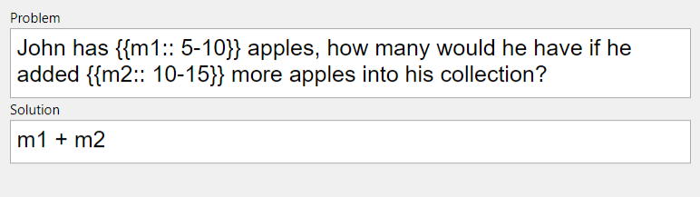
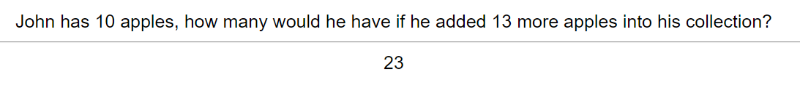

# Mathgen

Mathgen is an add-on for the app [Anki](https://apps.ankiweb.net/). It allows for the creation of math problem cards with values generated from a fixed range.

## Installation
Mathgen is currently supported for the latest version of Anki.
```bash
git clone https://github.com/MinXuann/mathgen.git
``` 
Move the `mathgen/mathgen` folder into your Anki add-on folder.

## Current Build
#### Editor

<br/>
#### Preview


- Utilises the Javascript `eval()` function for calculation of solution, but a easier way of evaluation is currently under development
